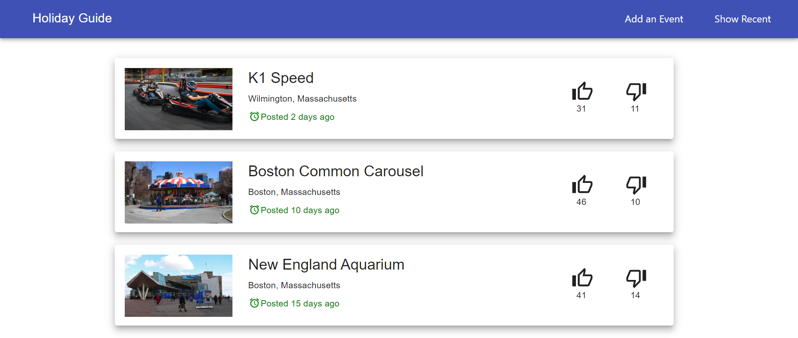

# Holiday Guide

A MERN Stack Web Application where users can discover fun activities in their preferred location.
Technologies Used : Front End - React, Redux and Material UI, Backend - Express.js and Node.js, Database - MongoDB

## Home Page

 

## Add a Post

